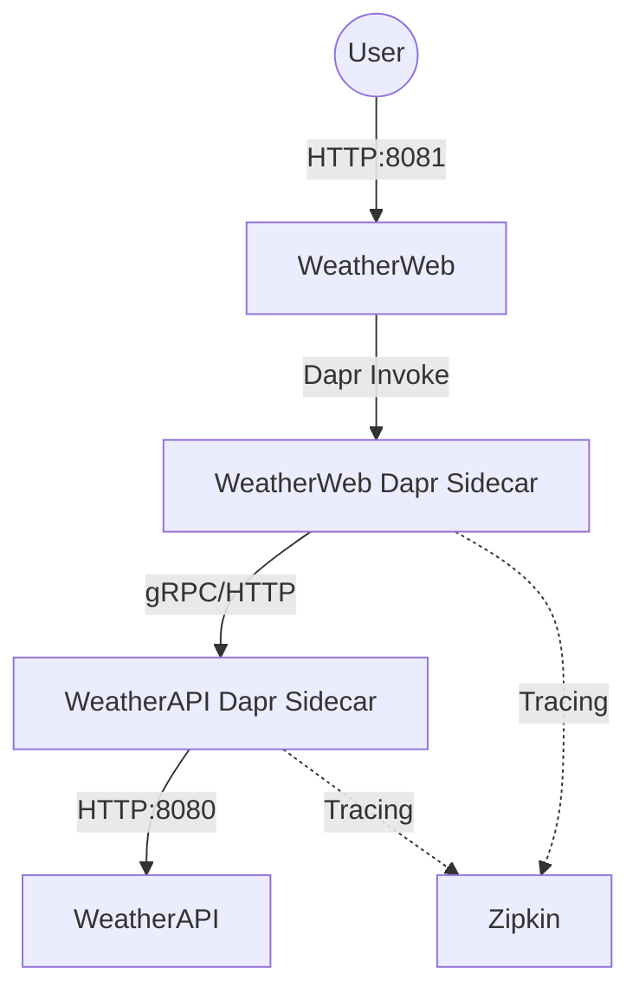

# containerApp

A cloud-native microservices application using .NET 10, Dapr, and Zipkin.

## 🏗️ Architecture

The application follows a microservices architecture pattern, utilizing Dapr sidecars for service-to-service communication and observability.

-   **Frontend (`WeatherWeb`)**: An ASP.NET Core Razor Pages application that serves the user interface.
-   **Backend (`WeatherService`)**: An ASP.NET Core Minimal API that provides weather forecast data.
-   **Dapr Sidecars**: Both services run with a Dapr sidecar (`daprd`) to handle service invocation and tracing.
-   **Observability**: Integrated with **Zipkin** for distributed tracing.
-   **Placement Service**: A Dapr placement service for actor and service discovery.

### Component Diagram



## 🚀 Tech Stack

-   **Languages**: C# (C# 13)
-   **Frameworks**: .NET 10.0 (ASP.NET Core)
-   **Infrastructure**:
    -   **Dapr**: Distributed Application Runtime
    -   **Docker**: Containerization
    -   **Docker Compose**: Local multi-container orchestration
    -   **Zipkin**: Distributed tracing
-   **CI/CD & Cloud**: Azure-ready configurations provided.

## 🛠️ Core Functionality

-   **Weather Forecast Generation**: The Backend API generates randomized weather data.
-   **Service Invocation**: The Frontend calls the Backend using Dapr's service invocation API.
-   **Distributed Tracing**: End-to-end traces are automatically captured and sent to Zipkin.
-   **Resilient Networking**: Service discovery and communication are handled by Dapr's reliable communication layer.

## 🏁 Getting Started

### Prerequisites
- Docker & Docker Compose installed.
- .NET 10 SDK (for local development).

### Running the Stack
```bash
docker compose up -d
```

### Accessing the Application
- **Frontend**: [http://localhost:8081](http://localhost:8081)
- **Zipkin Dashboard**: [http://localhost:9411](http://localhost:9411)
- **Weather API (Direct)**: [http://localhost:8080/weatherforecast](http://localhost:8080/weatherforecast)
- **Dapr Metadata (Web)**: [http://localhost:3500/v1.0/metadata](http://localhost:3500/v1.0/metadata)
- **Dapr Metadata (API)**: [http://localhost:3501/v1.0/metadata](http://localhost:3501/v1.0/metadata)
